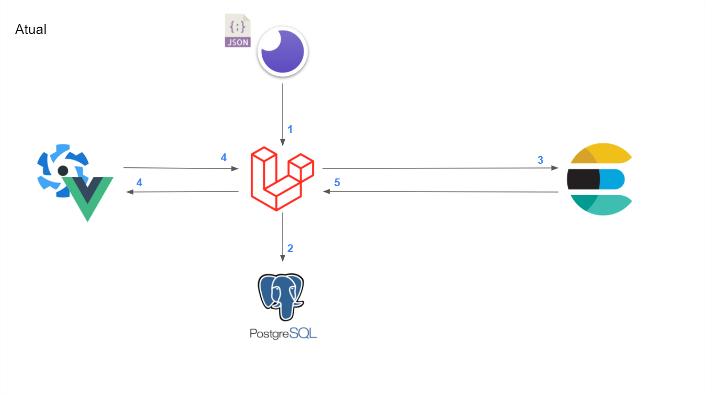
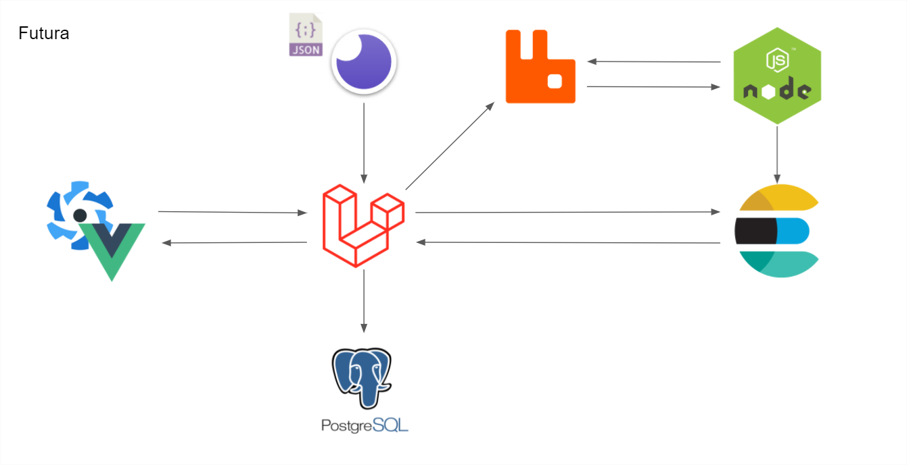
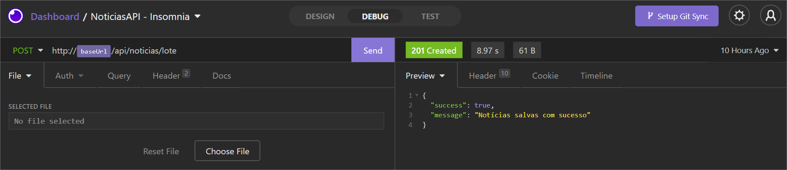

# Projeto Comunicação de Notícias

Com este projeto tenho por objetivo me aperfeiçoar como desenvolvedor.

## A problemática:

Dado um arquivo **[noticias.json](files/noticias.json)** tenho por objetivo fazer com que minha API Laravel recebe este conjunto de notícias e os salve diretamente no Banco de Dados PostgreSQL. De forma síncrona, por enquanto, que ele seja salvo no Elasticsearch para consulta posterior.
Ao abrir o FrontEnd escrito em Vuejs, juntamente com o Quasar Framework, que ele faça uma requisição à API do Laravel e que este por sua vez, não consulte o Banco de Dados do Postgre e sim os diretamente os documentos salvos no Elasticsearch, exindo na tela em formato de lista e detalhes.

<br>

## Arquitetura

Atualmente estou com esta arquitetura:



<br>

E o objetivo é fazer com que os serviços se comuniquem através do RabbitMQ:



<br>

## Instalação

Caso deseje configurar e testar siga os passos abaixo:

### Pre-requisitos

Na sua máquina, instale:

- Docker
- Node

<br>

### Configurando o FrontEnd

1. Acesse o diretório **quasar**. No terminal utilize o comando:

   ```bash
   npm install
   ```

### Subindo o Docker

1. No diretório principal do projeto

   ```bash
   docker-compose up -d --build
   ```

### Configurando a API - Laravel

1. Tendo subido os containers do Docker, acesse o projeto da API através do container.

   ```bash
   docker exec -it app bash
   ```

2. Cria o arquivo de configuração de ambiente com base no exemplo

   ```bash
   cp .env.example .env
   ```

3. Instala as dependências do framework

   ```bash
   composer install
   ```

4. Cria uma key única para a API do Laravel

   ```bash
   php artisan key:generate
   ```

5. Cria todas as tabelas no Banco de Dados do Postgree

   ```bash
   php artisan migrate
   ```

6. [Opcional] Caso deseje visualizar a documentação da API.

   ```bash
   php artisan scribe:generate
   ```

   - Você importar para Postman ou Insomnia, gerando automaticamente todas as requisições de cada rota da API. Fique atento(a) para a variável de ambiente apontando para a localhost. Precisa configurar para localhost:8080

     ```
     .\api\public\docs\collection.json
     ```

   - Visualizar Documentação da API em uma página da web

     ```
     .\api\public\docs\index.html
     ```

<br>

### Serviços e Portas

| Serviço        | Porta                     |
| -------------- | ------------------------- |
| Laravel        | http://localhost:8100/    |
| Laravel API    | http://localhost:8100/api |
| Elasticsearch  | http://localhost:9200/    |
| Quasar (Front) | http://localhost:8080/    |

<br>

### Utilizando o Projetos

1. Para salvar a lista de noticias envie o arquivo para a rota abaixo com o verbo POST:

   ```
   POST
   http://localhost:8080/api/noticias/lote
   ```

   É possível enviar um arquivo selecionado a opção **File**

   

2. Em seguida é possível visualizar o resultado abrindo em seu navegador:

   ```
   http://localhost:8080/
   ```

### Encerrando o projeto

1. No terminal, no diretório principal do projeto

```bash
docker-compose down -f
```
